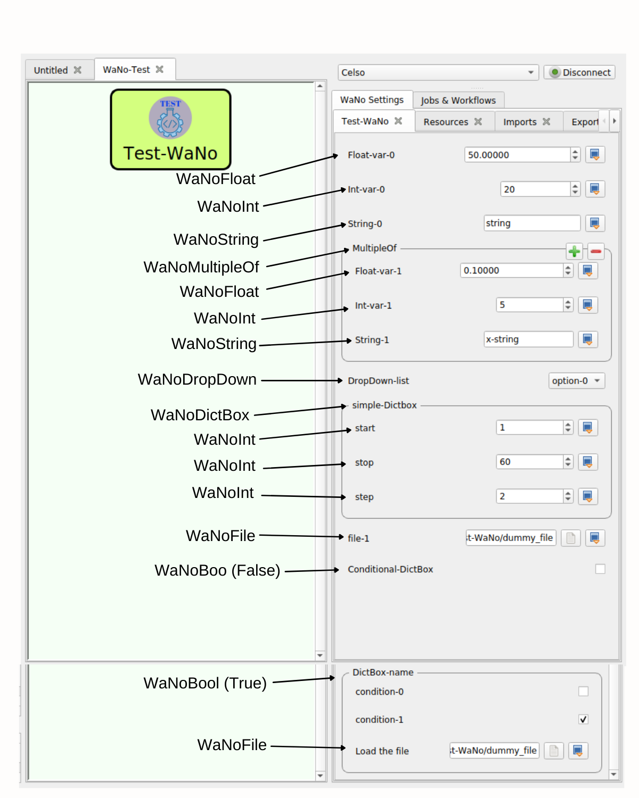

# Test-WaNo

The Test-WaNo WaNo implements the most used functionalities available within the SimStack workflow framework to define the inputs fields of the Graphical User Interface(GUI). Here we are covering the following set of Simstack features: `WaNoFloat`, `WaNoInt`, `WaNoString`, `WaNoDropDown`,`WaNoDictBox`, `WaNoFile`, `WaNoMultipleOf`, and conditional options using the `WaNoBool`tag. All the remaining input files are loaded from an external source.



Figure 1 displays the most used functionalities available within the SimStack workflow framework. The arrows associate the tags used to generate the field and variable types. The **DictBox-name** only popup when the bool variable `Conditional-DictBox` is `True`. 

## 1. Python Setup
To get this WaNo up running on your available computational resources, make sure to have the below libraries installed on Python 3.6 or newer.

```
1. matplotlib.
2. numpy.
3. yaml, sys. 
```

The python scripts run with the `simstack_kit` conda environment defined in the `WaNoExecCommand` tag as shown below. 
```
<WaNoExecCommand>
   export NANOVER=V4
   source $NANOMATCH/$NANOVER/local_anaconda/bin/activate
   conda activate simstack_kit
   python test-script.py
</WaNoExecCommand>
```
Other local environments are allowed but have to be changed accordingly in the respective tag of the `Test-WaNo.xml` file.


## 2. Test-WaNo Inputs files 
- **file-1**:  is the mandatory file required by this WaNo, as a test case you can use the *dummy_file* of this repo.
- **Load the file**: is only mandatory if the bool variable `Conditional-DictBox` is set to be `True`.

## 3. Test-WaNo Inputs files 
   - The `figure.png` image is the mandatory output of this WaNo
## 4. Report
   - By clicking with the right mouse button on the executed workflow folder we can choose the show report option, to visualize our pre-defined report.

